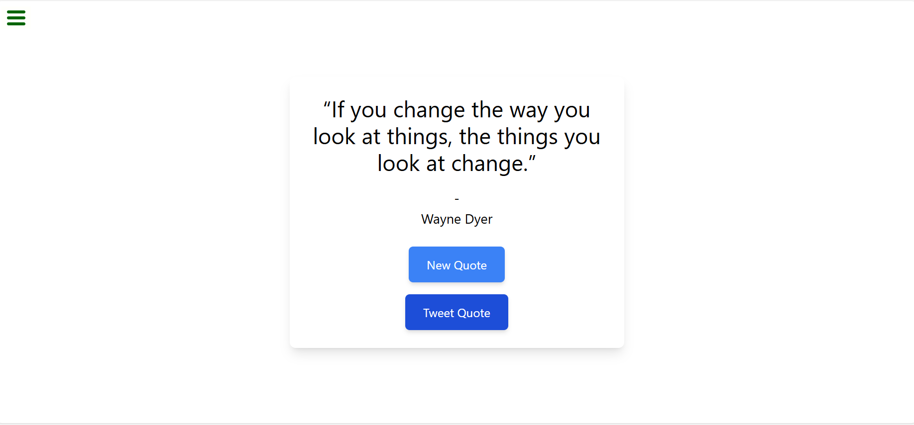

# Random Quote Machine 🚀

## Project Description 📝

> Random Quote Machine is a React application that generates and displays a random inspirational quote with each button click. Users can easily refresh the quote, and each one is styled to provide a visually engaging experience.

- Random Quote Machine project, inspired by a desire to provide quick, motivational insights, stands out for its sleek, responsive design, solving the problem of easy access to inspiring quotes while enhancing your skills in API integration, DOM manipulation, and event handling.


```javascript
  import React, { useState, useEffect } from 'react';

const App = () => {
  const [quote, setQuote] = useState('');
  const [author, setAuthor] = useState('');

  const fetchQuote = async () => {
    try {
      const response = await fetch('https://api.quotable.io/random');
      const data = await response.json();
      setQuote(data.content);
      setAuthor(data.author);
    } catch (error) {
      console.error('Error fetching the quote:', error); // eslint-disable-line no-console
    }
  };


```

## Demo 📸
[Live Demo](https://deploy-preview-1--boisterous-cupcake-dc91c8.netlify.app/)



## Technologies Used 🛠️

- HTML
- CSS
- JavaScript
- React
- tailwind CSS


## Installation 💻

```bash
1: Clone the Repository:
git clone https://github.com/Breshnahamidi20/random-quote-machine1.git
```

```bash
2: Navigate to the Project Directory:
cd random-quote-machine1
```

```bash
3: Open the index.html , App.js  and another Files in Your Browser.
```


## Usage 🎯

```bash
# Click the "New Quote" button to generate a random quote, and use the "Share" button to post it to social media.
```

## Features ⭐

- Random Quote Generation: Displays a new, randomly selected quote with each click.
- API Integration: Fetches quotes from an external source or database.
- Responsive Design: Optimized for both desktop and mobile devices.

## Author 👩‍💻

- [Linkedin](https://www.linkedin.com/in/breshna-hamidi-67699a295?utm_source=share&utm_campaign=share_via&utm_content=profile&utm_medium=android_app)
- [Email](breshna2004@gmail.com)

## Contributing 🤝
